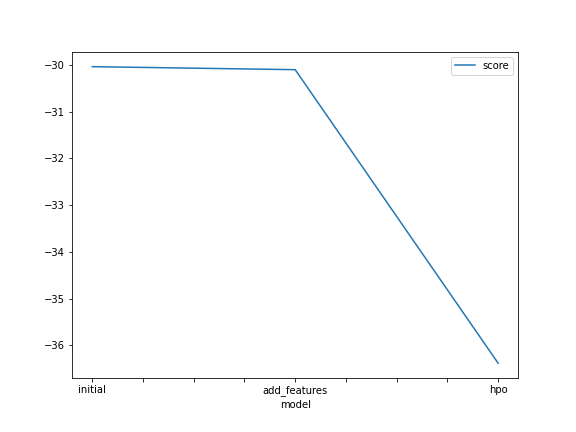
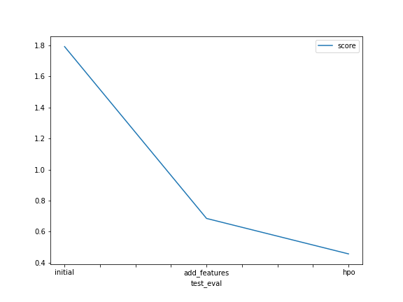

# Report: Predict Bike Sharing Demand with AutoGluon Solution
#### Buse Varkan

## Initial Training
### What did you realize when you tried to submit your predictions? What changes were needed to the output of the predictor to submit your results?
I had hard times using and importing kaggle. I had errors related to path, and I needed to specify it. 

### What was the top ranked model that performed?
Top ranked model is hyperparamter tuned model with score 0.45654. 

## Exploratory data analysis and feature creation
### What did the exploratory analysis find and how did you add additional features?
I splitted datetime into 4 parts such as year, month, day and hour. 

### How much better did your model preform after adding additional features and why do you think that is?
It changed score from 1.79204 to 0.68493. It is an improvement by %0.62 .

## Hyper parameter tuning
### How much better did your model preform after trying different hyper parameters?
After trying different hyperparameters, my model got score 0.45654. It is the best score it gets. So, I can say it increased %0.75 from raw model, and %0.35 from add_features model.

### If you were given more time with this dataset, where do you think you would spend more time?
I would spend more time on adding or deleting feature, and also on hyper parameters. But more importantly, I would try to understand the features and what they actually tell, rather them seeing them as numbers. 

### Create a table with the models you ran, the hyperparameters modified, and the kaggle score.
model	hpo1	hpo2	hpo3	score
0	initial	default	default	default	1.79204
1	add_features	default	default	default	0.68493
2	hpo	nn	gbm	?	0.45654
### Create a line plot showing the top model score for the three (or more) training runs during the project.

TODO: Replace the image below with your own.

### Create a line plot showing the top kaggle score for the three (or more) prediction submissions during the project.

TODO: Replace the image below with your own.

## Summary
This project was a good way to see how small differences in data and model can yield big differences in results. Even by seperating datetime into its compenents, we had great impact on score. Also, changing hyperparameters in model can increase the result so much.
